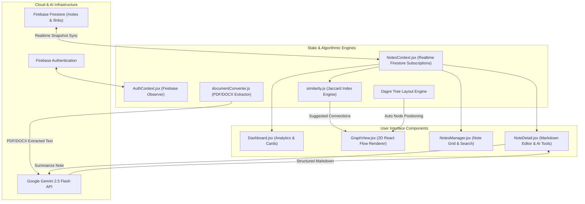

# DiNotes — AI-Powered Knowledge Mapping & Markdown Platform 🧠

> **Visual note-taking, interactive 2D knowledge graph visualization, algorithmic similarity mapping, and Gemini AI document parsing.**

[](https://react.dev)
[](https://vite.dev)
[](https://firebase.google.com)
[](https://tailwindcss.com)
[](LICENSE)
[](docs/CONTRIBUTING.md)

---

## 📌 What is DiNotes?

**DiNotes** is an open-source visual knowledge mapping and Markdown note-taking web application designed to turn fragmented notes into an interconnected network of thoughts. DiNotes bridges plain text editing with interactive node graphs, enabling users to visualize relationships between ideas, auto-convert PDF/DOCX documents into clean Markdown using **Google Gemini AI**, and discover non-obvious conceptual connections using a **Jaccard Similarity Matrix Engine**.

---

## ✨ Key Features

- 🕸️ **Interactive 2D Knowledge Graph**: Powered by **React Flow** and **Dagre**, offering top-to-bottom tree layouts, focus node isolation, and interactive link creation.
- 🤖 **Gemini AI Document Converter**: Upload PDF or DOCX files to extract text and format them into clean, structured Markdown using **Google Gemini 2.5 Flash**.
- 📝 **Full Markdown Editor & Live Preview**: Real-time rendering with GitHub Flavored Markdown (`react-markdown` & `remark-gfm`).
- 📐 **Algorithmic Jaccard Similarity Engine**: Quantifies note overlap across tags (40%), title tokens (30%), and content tokens (30%) to suggest hidden connections.
- 🔍 **Topological Pathfinder**: Finds the shortest link distance between any two notes in your personal knowledge network.
- 🔒 **Secure Firebase Architecture**: User authentication via Firebase Auth and multi-tenant document isolation backed by Firestore Security Rules.
- 🌙 **Customizable Theme & Preferences**: Built-in dark/light theme switching, graph node label toggles, and layout controls.

---

## 🏗️ Architecture & Data Flow

DiNotes connects client-side state hooks with Firebase Firestore realtime listeners, Dagre layout calculation, and Gemini AI endpoints:



---

## 🛠️ Tech Stack

| Domain | Technology | Description |
| :--- | :--- | :--- |
| **Frontend Core** | [React 19.2](https://react.dev) | Modern component state, custom context hooks (`AuthContext`, `NotesContext`) |
| **Build System** | [Vite 8.0](https://vite.dev) | High-speed HMR development server and production bundler |
| **Styling & UI** | [Tailwind CSS 3.4](https://tailwindcss.com) | Utility-first styling, glassmorphism UI, custom dark theme tokens |
| **Graph Visualization** | [React Flow 11](https://reactflow.dev) & [Dagre](https://github.com/dagrejs/dagre) | Interactive 2D graph canvas and automated tree layout engine |
| **Backend & Storage** | [Firebase 12](https://firebase.google.com) | Authentication (Email/Password) and Firestore NoSQL realtime database |
| **AI Integration** | [Google Gemini 2.5 Flash](https://ai.google.dev) | Document-to-Markdown parsing & automated note summarization |
| **Document Parsers** | `pdfjs-dist` & `mammoth` | Client-side text extraction from PDF and DOCX documents |
| **Static Analysis** | [ESLint 9.39](https://eslint.org) | Flat config code linting and React Hooks enforcement |

---

## 📂 Project Structure

```text
DiNotes/
├── .github/
│   ├── ISSUE_TEMPLATE/
│   │   ├── bug_report.md         # Standardized bug reporting template
│   │   └── feature_request.md    # Feature suggestion template
│   ├── workflows/
│   │   └── ci.yml                # GitHub Actions automated build & lint workflow
│   ├── CODEOWNERS                # Maintainer code ownership definitions
│   ├── PULL_REQUEST_TEMPLATE.md  # Contributor PR submission checklist
│   └── dependabot.yml            # Automated dependency update configuration
├── docs/
│   ├── GETTING_STARTED.md        # Comprehensive installation & running guide
│   ├── ARCHITECTURE.md           # System design, Jaccard engine & database schema
│   ├── DEVELOPMENT.md            # Available scripts, build pipeline & styling
│   ├── CONTRIBUTING.md           # Contributor guidelines and workflow
│   ├── SECURITY.md               # Security policy & data isolation rules
│   └── FAQ.md                    # Frequently asked project questions
├── public/                       # Static web assets
├── src/
│   ├── components/
│   │   ├── common/
│   │   │   └── MetricCard.jsx    # Analytics stat card component
│   │   ├── layout/
│   │   │   ├── AppLayout.jsx     # Main shell wrapper
│   │   │   ├── Navbar.jsx        # Navigation bar component
│   │   │   └── Sidebar.jsx       # Side navigation bar
│   │   └── notes/
│   │       ├── LinkModal.jsx     # Connection creation modal
│   │       ├── NoteCard.jsx      # Note preview card component
│   │       └── NoteModal.jsx     # Quick note creation modal
│   ├── context/
│   │   ├── AuthContext.jsx       # Firebase authentication state
│   │   ├── NotesContext.jsx      # Firestore realtime data state
│   │   ├── SettingsContext.jsx   # Graph layout & feature toggles
│   │   └── ThemeContext.jsx      # Dark/light theme state
│   ├── pages/
│   │   ├── Dashboard.jsx         # Overview dashboard page
│   │   ├── GraphView.jsx         # 2D Knowledge Graph view
│   │   ├── Login.jsx             # User authentication login
│   │   ├── NoteDetail.jsx        # Note markdown editor & viewer
│   │   ├── NotesManager.jsx      # Note list & grid manager
│   │   ├── Settings.jsx          # App configuration & data purge
│   │   └── Signup.jsx            # User registration page
│   ├── services/
│   │   ├── authService.js        # Firebase Auth wrapper methods
│   │   ├── firebase.js           # Firebase SDK initialization
│   │   └── noteService.js        # Firestore CRUD & realtime subscriptions
│   ├── utils/
│   │   ├── documentConverter.js  # PDF/DOCX extraction & Gemini AI converter
│   │   ├── similarity.js         # Jaccard similarity & AI summarization
│   │   └── timeFormat.js         # Relative date formatting utility
│   ├── App.css                   # Custom styles & keyframe animations
│   ├── App.jsx                   # React Router routing configuration
│   ├── index.css                 # Global CSS reset & Tailwind imports
│   └── main.jsx                  # Application entry point
├── .env.example                  # Environment variable configuration template
├── .gitignore                    # Git tracking rules
├── eslint.config.js              # ESLint Flat Config rules
├── firestore.rules               # Firestore security rules
├── index.html                    # HTML shell
├── LICENSE                       # MIT License
├── package.json                  # Dependencies & scripts manifest
├── postcss.config.js             # PostCSS Tailwind plugin config
├── README.md                     # Project landing documentation
├── tailwind.config.js            # Tailwind CSS configuration
└── vite.config.js                # Vite bundler configuration
```

---

## 🚀 Getting Started

### Prerequisites

- **Node.js**: `v18.0.0` or higher
- **npm**: `v9.0.0` or higher
- **Firebase Project**: Free account with Auth & Firestore enabled.

### Quickstart

1. **Clone the repository**:
   ```bash
   git clone https://github.com/TheVicky1/DiNotes.git
   cd DiNotes
   ```

2. **Install dependencies**:
   ```bash
   npm install
   ```

3. **Setup Environment Variables**:
   Copy `.env.example` to `.env`:
   ```bash
   cp .env.example .env
   ```
   Fill in your Firebase keys and optional Google Gemini API key in `.env`.

4. **Start local development server**:
   ```bash
   npm run dev
   ```
   Open `http://localhost:5173` in your browser.

5. **Build for production**:
   ```bash
   npm run build
   ```

6. **Run static analysis**:
   ```bash
   npm run lint
   ```

---

## ⚙️ Environment Configuration

| Variable | Description |
| :--- | :--- |
| `VITE_API_KEY` | Firebase API Key |
| `VITE_AUTH_DOMAIN` | Firebase Auth Domain (`project.firebaseapp.com`) |
| `VITE_PROJECT_ID` | Firebase Project ID |
| `VITE_STORAGE_BUCKET` | Firebase Storage Bucket |
| `VITE_MESSAGING_SENDER_ID` | Firebase Messaging Sender ID |
| `VITE_APP_ID` | Firebase App ID |
| `VITE_MEASUREMENT_ID` | Firebase Measurement ID |
| `VITE_GEMINI_API_KEY` | Google Gemini API Key *(for AI PDF/DOCX conversion & summarization)* |

---

## 📖 Documentation Architecture

Explore deeper technical guides in the [`docs/`](docs/) directory:

- 🏎️ **[Getting Started Guide](docs/GETTING_STARTED.md)** — Detailed setup instructions.
- 📐 **[Architecture Overview](docs/ARCHITECTURE.md)** — Jaccard math formula, graph engine, and database schema.
- 💻 **[Development Guide](docs/DEVELOPMENT.md)** — Available scripts, build pipeline, and styling.
- 🤝 **[Contributing Guidelines](docs/CONTRIBUTING.md)** — Contribution workflow and PR guidelines.
- 🔒 **[Security Policy](docs/SECURITY.md)** — Data isolation safeguards and vulnerability reporting.
- ❓ **[FAQ](docs/FAQ.md)** — Answers to common implementation questions.

---

## 🤝 Contributing

Contributions make the open-source community an amazing place to learn, inspire, and create. Any contributions you make are **greatly appreciated**.

1. Fork the Project
2. Create your Feature Branch (`git checkout -b feature/AmazingFeature`)
3. Commit your Changes (`git commit -m 'feat: Add some AmazingFeature'`)
4. Push to the Branch (`git push origin feature/AmazingFeature`)
5. Open a Pull Request

Please review our [Contributing Guidelines](docs/CONTRIBUTING.md) for details.

---

## 🔒 Security

For security vulnerability reporting and Firestore access policy details, please refer to our [Security Policy](docs/SECURITY.md).

---

## 📜 License

Distributed under the MIT License. See [`LICENSE`](LICENSE) for more information.

---

## 💖 Acknowledgements

- [React Flow](https://reactflow.dev) & [Dagre](https://github.com/dagrejs/dagre) for 2D graph layout.
- [Google Gemini API](https://ai.google.dev) for AI document parsing and note summarization.
- [Firebase](https://firebase.google.com) for authentication and cloud database support.
- [Lucide Icons](https://lucide.dev) for modern iconography.
