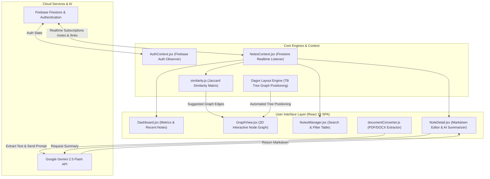

# System Architecture & Technical Design

This document details the software architecture, data flow, graph rendering engine, AI integration, and database schema of **DiNotes**.

---

## Technical Overview

DiNotes is structured as a client-side Single Page Application (SPA) backed by Firebase Firestore and Google Gemini 2.5 Flash API.



---

## Core Systems & Capabilities

### 1. Interactive 2D Knowledge Graph
- **Graph Renderer**: Powered by [React Flow](https://reactflow.dev) (`reactflow`).
- **Automated Graph Layout**: Uses [Dagre](https://github.com/dagrejs/dagre) graph library (`dagre`) to perform top-to-bottom (`TB`) tree layout positioning with automated rank separation.
- **Graph Modes**:
  - **Default**: Renders user-created conceptual links.
  - **Focus Mode**: Highlights connected neighbor nodes for a targeted note while dimming non-relevant nodes.
  - **Similarity Mode**: Dynamically generates visual similarity connections between notes with $\ge 25\%$ similarity.
  - **Pathfinder Mode**: Computes shortest topological connection paths between two arbitrary notes.

---

### 2. Algorithmic Jaccard Similarity Engine

Located in [`src/utils/similarity.js`](../src/utils/similarity.js), the similarity calculator combines three criteria to quantify semantic overlap:

$$S(A, B) = 0.4 \cdot \text{Overlap}(\text{Tags}) + 0.3 \cdot J(\text{Title}_A, \text{Title}_B) + 0.3 \cdot J(\text{Content}_A, \text{Content}_B)$$

Where $J(X, Y)$ is the Jaccard index over tokenized sets after removing stop-words:

$$J(X, Y) = \frac{|X \cap Y|}{|X \cup Y|}$$

---

### 3. AI Document Conversion & Note Summarization

Located in [`src/utils/documentConverter.js`](../src/utils/documentConverter.js) and [`src/utils/similarity.js`](../src/utils/similarity.js):
- **PDF Extraction**: Dynamic import of `pdfjs-dist` worker parses page-by-page text content.
- **DOCX Extraction**: Dynamic import of `mammoth` extracts raw document text.
- **Gemini 2.5 Flash API**: Raw document text is transmitted to `gemini-2.5-flash:generateContent` to convert plain document text into structured Markdown.

---

## Firestore Database Schema

### Collection: `notes`
```typescript
interface NoteDocument {
  id: string;          // Auto-generated Firestore ID
  userId: string;      // Firebase Auth UID
  title: string;       // Note title
  content: string;     // Raw Markdown content
  tags: string[];      // Array of tag strings
  summary?: string;    // AI-generated note summary
  createdAt: timestamp; // Server timestamp
  updatedAt: timestamp; // Server timestamp
}
```

### Collection: `links`
```typescript
interface LinkDocument {
  id: string;          // Auto-generated Firestore ID
  userId: string;      // Firebase Auth UID
  sourceId: string;    // Source Note ID
  targetId: string;    // Target Note ID
  createdAt: timestamp; // Server timestamp
}
```
